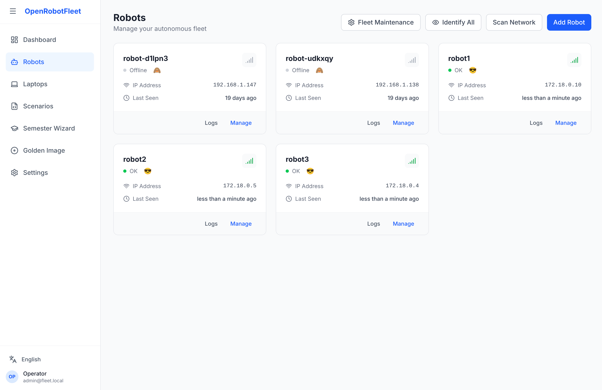
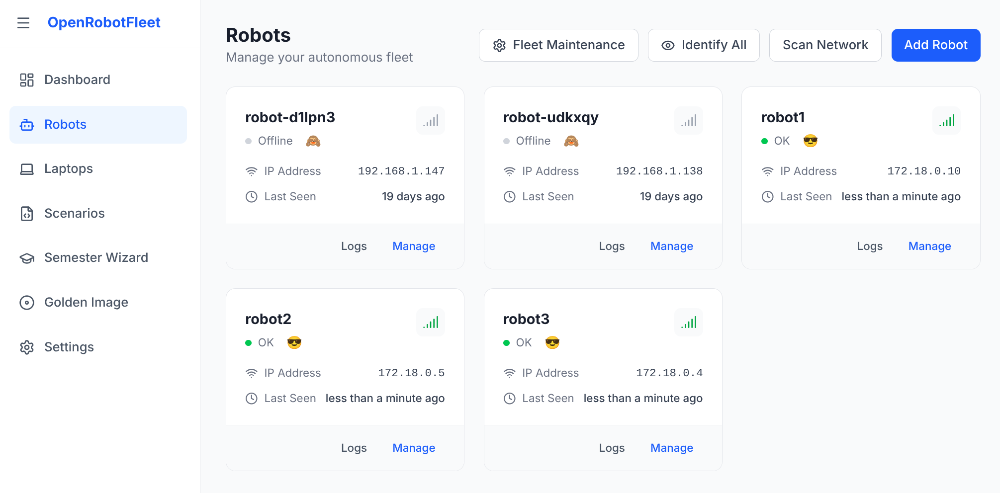
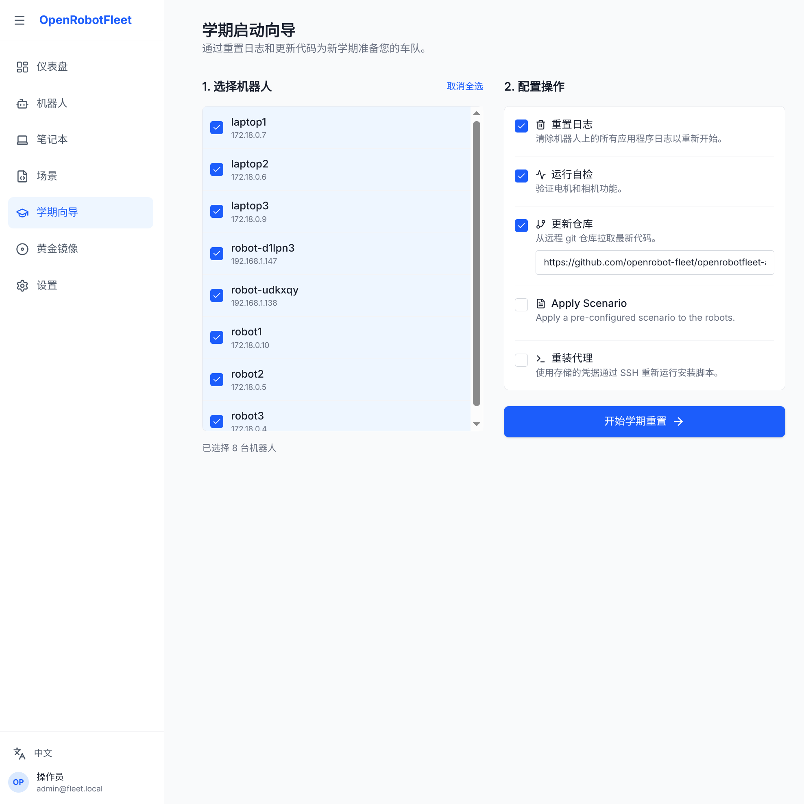
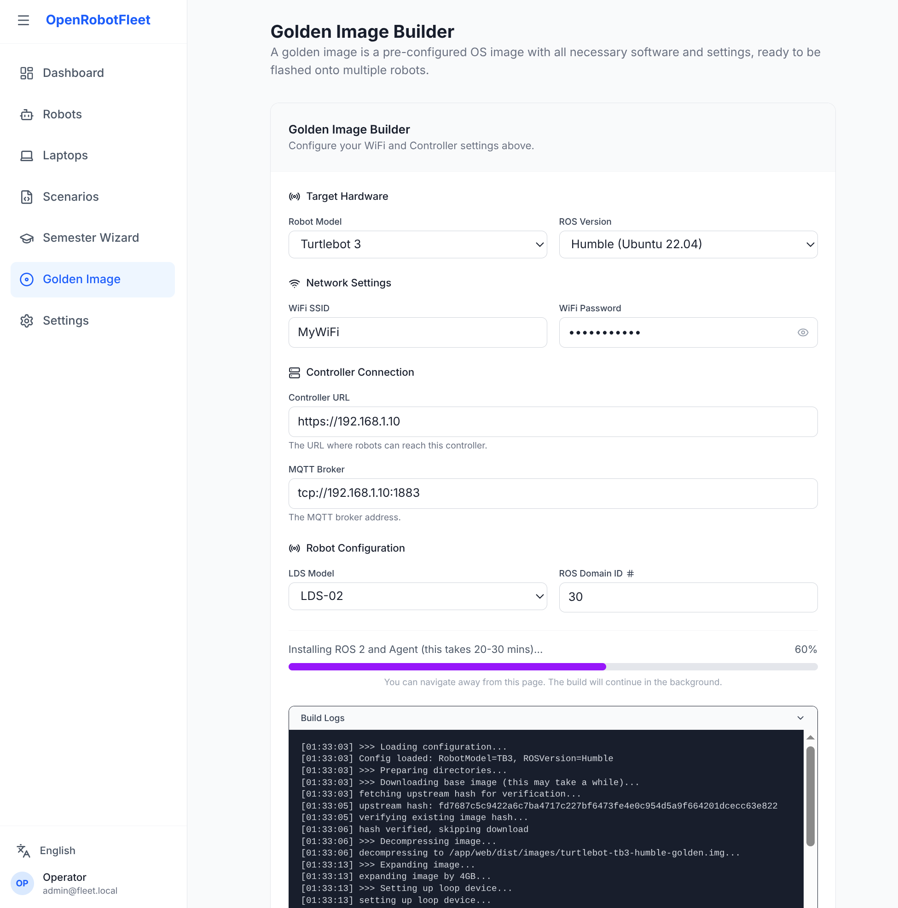

# OpenRobotFleet

**Effortless orchestration for your robotics classroom or lab.**

## Screenshots









OpenRobotFleet helps instructors and lab managers maintain control over a fleet of robots (and laptops). Instead of manually SSH-ing into 30 robots to pull the latest code or restart a service, you can manage everything from a single web dashboard.

## Why use this?

* **Save Time**: Push code updates to your entire fleet in seconds, not hours.
* **Reduce Friction**: Reset robots for the next class with a "Semester Wizard" that wipes logs and updates code.
* **Stay Informed**: See at a glance which robots are online, their battery status (if reported), and what code they are running.
* **Unified Management**: Manage your robots and development laptops in one place.

## Key Features

### 🤖 Fleet Overview

Instantly see the status of every robot in your lab. Know their IP addresses, last seen times, and current operational status (and mood!) without scanning the network.

### 📦 One-Click Code Deployment ("Scenarios")

Define "Scenarios" (e.g., "Lab 1", "Midterm Project") that point to specific Git repositories and branches. Apply these scenarios to one robot or the whole fleet to ensure everyone is running the correct code.

### 🔄 Remote Control

* **Restart ROS**: specific services or the whole stack.
* **Reset Logs**: Clear out old log files to free up space.
* **WiFi Configuration**: Connect laptops/robots to the network remotely.

### 🎓 Semester Wizard

A dedicated tool for teaching assistants and instructors to batch-reset the fleet. Reinstall agents, wipe logs, update repositories, and apply specific scenarios (batch code deployment) for the new semester in one go.

### 💻 Laptop Support

Manage lab laptops just like robots. Push code updates and manage WiFi profiles on Ubuntu-based development machines.

## Getting Started

The fastest way to get a lab fleet up and running is:

1) build a **Golden Image**, 2) flash it onto every robot, 3) ensure everything is on the same **Layer 2** network, 4) define **YAML Scenarios** for the code you want deployed, then 5) manage the fleet from the dashboard.

### Quick Start (Golden Image + Scenarios)

#### 0) Prerequisites

* A machine to run the Controller (same network as the fleet)
* Docker + Docker Compose
* Your robots/laptops are reachable on the same Layer 2 network (same WiFi/VLAN/subnet)

#### 1) Configure and start the Controller (Docker)

1. Create a local env file:

```bash
    cp .env.example .env
```

2. Edit `.env` (most important: the network(s) to scan):

        - `SCAN_SUBNETS` controls what the Controller scans for SSH-able hosts (comma-separated).
            Example: `SCAN_SUBNETS=192.168.1.0/24,10.0.0.0/24`
        - `ADMIN_PASSWORD` sets the dashboard admin password.
        - If you set a real public domain, also set `ACME_EMAIL` to a real email (Let’s Encrypt rejects `example.com`).

3. Start the stack:

```bash
    docker compose up --build
```

4. Open the dashboard:

* Local: `https://localhost` (you may get a browser TLS warning)

#### 2) Build + flash a Golden Image

1. In the dashboard, go to **Golden Image**.
2. Fill in WiFi + Controller/MQTT settings.
3. Click **Build** (this produces the base image) and/or **Download** (this downloads the `user-data` cloud-init config used by the image).
4. Flash the resulting image onto every robot.

The Golden Image config bakes in the Agent configuration so robots come up pre-connected (no per-robot SSH install step).

#### 3) Power on robots on the same Layer 2 network

* Put the Controller machine and all robots/laptops on the same WiFi/VLAN/subnet.
* Ensure the Controller can reach them (and they can reach the Controller’s MQTT broker).

Once powered on, robots should start appearing in the dashboard as they connect and send status.

#### 4) Create YAML Scenarios (code deployment)

Scenarios are small YAML snippets that declare what git repo each robot/laptop should have.

Minimal example:

```yaml
repo:
        url: https://github.com/your-org/your-repo.git
```

Optional fields:

```yaml
repo:
        url: https://github.com/your-org/your-repo.git
        branch: main
        # Path is relative to the agent's workspace_path (robots default to /home/ubuntu/ros_ws/src)
        path: my-repo-folder
```

Create scenarios in the dashboard (**Scenarios**) and paste the YAML. Then apply the scenario to one robot to validate, and finally to the whole fleet.

### 5) Install the Agent onto Laptops (and any non-golden imaged Robots)

* Use the **Scan Network** button under **Laptops** or **Robots** pages to find and enrol new devices

#### 6) Use the app

* Use **Robots** / **Laptops** to monitor status.
* Use **Scenarios** to deploy code.
* Use tools like **Semester Wizard** / **Restart ROS** / **Reset Logs** as needed.

## How it Works

1. **Install the Agent**: Use the "Add Robot" or "Add Laptop" tab in the dashboard. You'll need the IP address and SSH credentials of the target machine once. The system will install a lightweight agent that runs in the background.
2. **The Agent**: This small program runs on the robot, keeping it connected to your dashboard and listening for your commands.
3. **The Dashboard**: Your command center. It talks to the robots via a central server (included in the Docker setup).

## Common Tasks

### Adding a New Robot

Navigate to the **Robots** tab and click **Add Robot**. Enter the IP address, username (usually `ubuntu`), and SSH key/password. The manager will handle the rest.

### Deploying Code for a Class

1. Go to **Scenarios** and create a new Scenario.
2. Enter the Git URL (e.g., `https://github.com/your-course/lab1.git`) and the branch name.
3. Click **Apply**, select the robots, and watch them update.

### Fixing a "Stuck" Robot

If a robot is behaving strangely, try the **Restart ROS** command from the robot's detail page. If that fails, you can use the **Terminal** view (if configured) or check the logs remotely.

## Technical Details (For the curious)

Under the hood, this system uses:

* **Go**: For a fast, reliable backend and agent.
* **React**: For a responsive web interface.
* **MQTT**: For communication between robots, laptops and the server.
* **Batch Architecture**: Commands are bundled and sent to agents for atomic, sequential execution, ensuring reliability even with intermittent network connectivity.
* **SQLite**: For simple, self-contained data storage.
* **Secrets**: The dashboard might respond to a classic cheat code...

## Development

See [CONTRIBUTING.md](CONTRIBUTING.md) for instructions on how to run the project locally for development.

## Contributing

Contributions are welcome! Please see [CONTRIBUTING.md](CONTRIBUTING.md) for details.

## License

This project is licensed under the MIT License - see the [LICENSE](LICENSE) file for details.

---
*Built for ROS 2 systems, including Turtlebots and most Ubuntu-based robots.*
