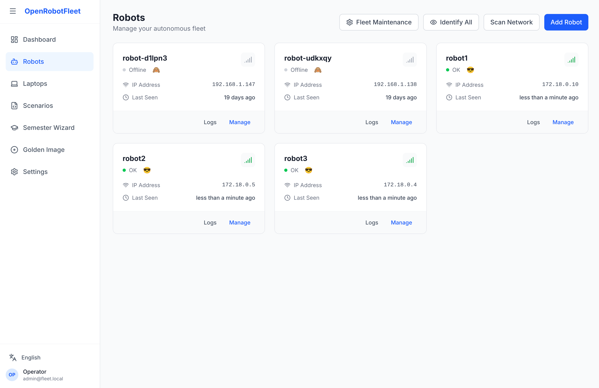
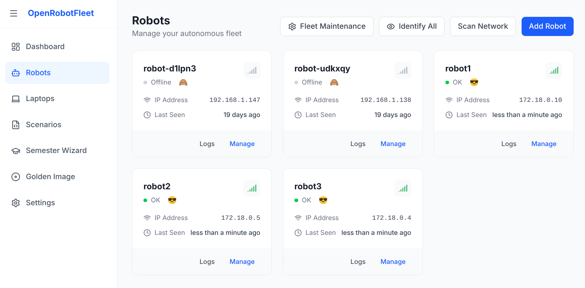
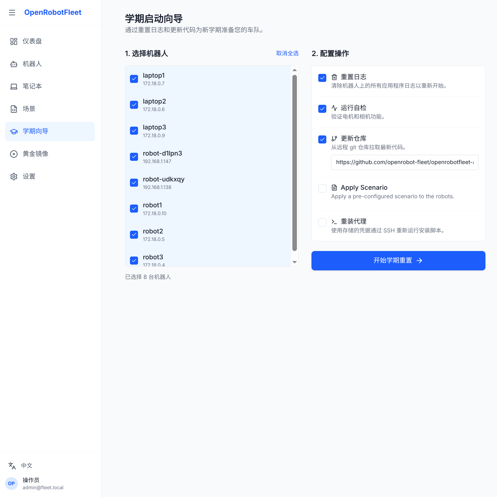
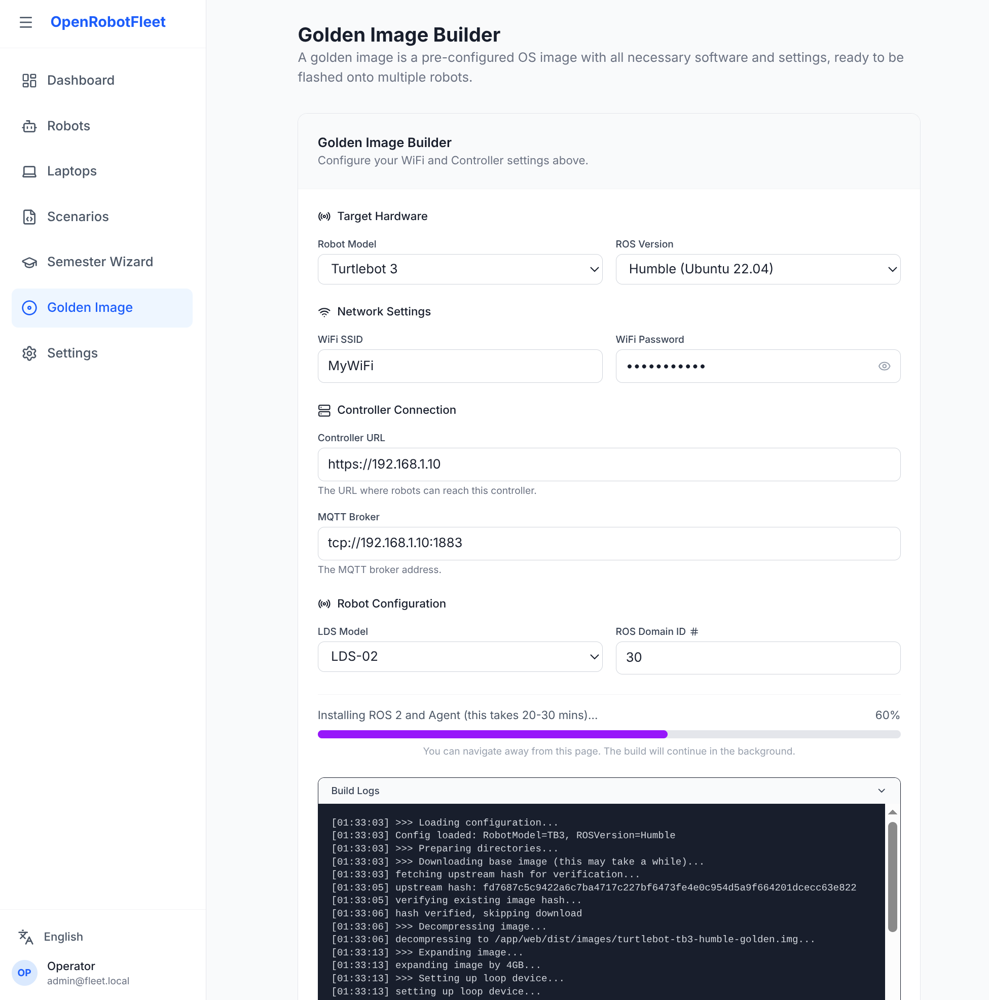

# OpenRobotFleet

> **Manage an entire robotics lab from one browser.**
>
> Deploy code, monitor robots, prepare practical classes, and reset your fleet in minutes—not hours.

OpenRobotFleet is a fleet management platform for ROS 2 teaching laboratories and research groups. It removes the repetitive work involved in maintaining multiple robots so instructors, researchers and teaching assistants can spend more time teaching and experimenting.

Whether you're running 6 TurtleBots for a lab class or dozens of robots across multiple projects, OpenRobotFleet helps keep every machine in a known, consistent state.

---

## Built for robotics labs

Managing a robotics fleet usually means:

- SSH-ing into every robot before class
- Pulling Git repositories one machine at a time
- Restarting ROS when something breaks
- Resetting robots after every practical
- Wondering which robot is running which code

OpenRobotFleet automates these everyday tasks.

Instead of managing robots individually, you manage the fleet.

---

# Get started in under 30 minutes

Most labs can be running in four steps.

### 1. Start OpenRobotFleet

Run the Controller using Docker.

```bash
cp .env.example .env
docker compose up --build
```

### 2. Build a Golden Image

Use the built-in image builder to create a preconfigured robot image.

Flash that image onto each robot.

### 3. Power on your robots

Robots automatically connect to the Controller and appear in the dashboard.

No manual installation or SSH setup required.

### 4. Deploy your course or research code

Create a Scenario pointing at your Git repository.

Click **Deploy**.

Every selected robot updates itself automatically.

---

# Screenshots









---

# Why academics use OpenRobotFleet

## Save hours before every laboratory

Deploy software updates to every robot simultaneously instead of repeating the same commands dozens of times.

---

## Start every class from a known state

The Semester Wizard prepares an entire fleet by:

- updating repositories
- clearing logs
- reinstalling agents
- applying teaching scenarios

Perfect for practical classes.

---

## Know what's happening at a glance

See every robot from one dashboard.

Monitor:

- online/offline status
- battery level
- deployed software
- last contact time
- IP address
- health information

---

## Keep students on the same software version

Scenarios ensure every robot receives exactly the same code.

No more "it works on Robot 4 but not Robot 7."

---

## Manage robots and laptops together

Ubuntu development laptops appear alongside robots, making it easy to keep an entire teaching lab synchronised.

---

# Features

## Fleet Dashboard

Monitor every robot from a single web interface.

---

## Scenarios

Reusable deployment profiles for:

- laboratory exercises
- assignments
- demonstrations
- research experiments

Each Scenario simply references a Git repository and optional branch.

Deploy to one robot or the whole fleet.

---

## Golden Image Builder

Create a reusable base image containing:

- WiFi configuration
- Controller settings
- Fleet agent

Flash once and every robot automatically joins the fleet.

---

## Semester Wizard

Prepare an entire laboratory for a new semester with a single operation.

---

## Remote Administration

Without opening SSH you can:

- restart ROS
- clear logs
- configure WiFi
- deploy software
- monitor robot status

---

# Typical workflows

## Before a practical class

1. Deploy the "Lab 4" Scenario.
2. Wait for updates.
3. Verify every robot is online.

Done.

---

## Between student groups

Run Semester Wizard.

Every robot is reset and ready for the next class.

---

## During research

Deploy experimental branches to selected robots while leaving the rest of the fleet untouched.

Track exactly which robot is running which experiment.

---

# Installation

## Requirements

- Docker + Docker Compose
- Ubuntu-based robots or laptops
- Layer-2 network (same WiFi/VLAN/subnet)

### Configure

```bash
cp .env.example .env
```

Edit:

- `SCAN_SUBNETS`
- `ADMIN_PASSWORD`

Then launch:

```bash
docker compose up --build
```

Visit

```
https://localhost
```

---

# Creating a Scenario

Minimal example:

```yaml
repo:
  url: https://github.com/your-org/your-repository.git
```

With optional branch:

```yaml
repo:
  url: https://github.com/your-org/your-repository.git
  branch: main
  path: my-package
```

---

# Under the hood

OpenRobotFleet is built using:

- Go
- React
- MQTT
- SQLite

Agents communicate with the Controller using reliable batch-based execution, allowing commands to complete even when connectivity is intermittent.

---

# Contributing

Contributions are welcome.

See `CONTRIBUTING.md`.

---

# License

MIT

---

*Designed for ROS 2 teaching laboratories, research groups and Ubuntu-based robot fleets.*